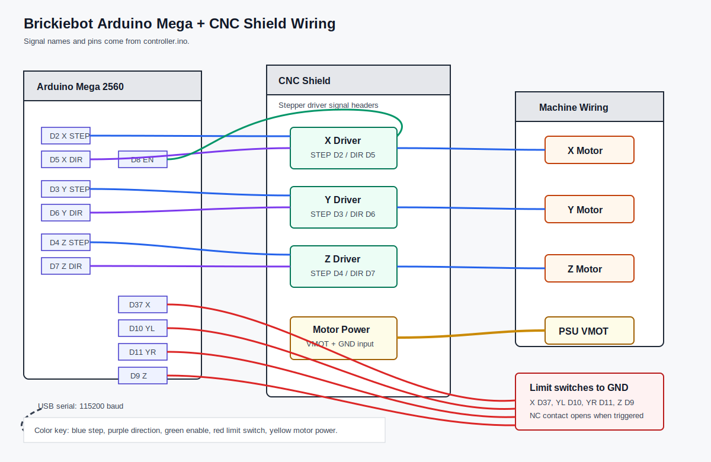
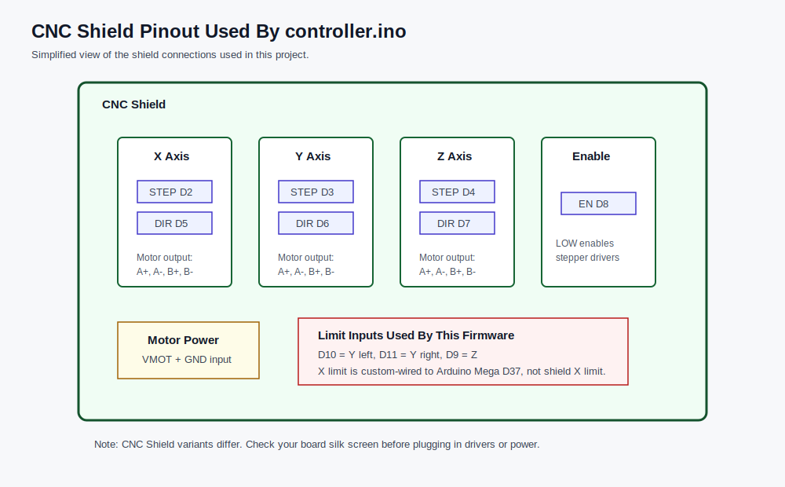
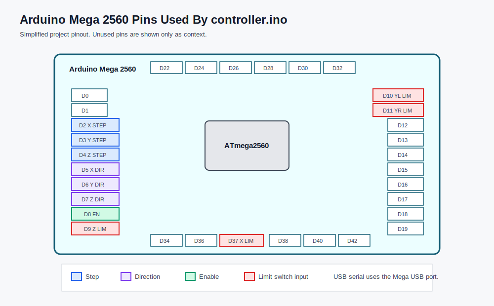

# Brickiebot Arduino Mega CNC Shield Controller

This folder contains the Arduino firmware for the Brickiebot motion controller.
The controller is an Arduino Mega connected to a CNC Shield-style stepper driver
board. The firmware drives three stepper axes, reads four limit switches, homes
the machine, and receives velocity commands over USB serial.

## Diagrams







The diagrams above are project-specific wiring diagrams based on
`controller.ino`. They show the pins used by this firmware, not every pin
available on the CNC Shield or Arduino Mega.

## Hardware

- Arduino Mega 2560
- CNC Shield-style stepper driver board
- 3 stepper driver channels for X, Y, and Z
- 4 stepper motors total: X motor, two Y motors, and Z motor
- X, Y left, Y right, and Z limit switches
- External motor power supply connected to the CNC Shield motor input
- USB serial connection to the host computer

## Firmware Pin Map

| Function | Arduino Mega pin | CNC Shield label / role | Notes |
| --- | ---: | --- | --- |
| Stepper enable | D8 | EN | `LOW` enables the stepper drivers. |
| X step | D2 | X STEP | Step pulse output. |
| X direction | D5 | X DIR | Direction output. |
| Y step | D3 | Y STEP | Step pulse output. |
| Y direction | D6 | Y DIR | Direction output. |
| Z step | D4 | Z STEP | Step pulse output. |
| Z direction | D7 | Z DIR | Direction output. |
| X limit switch | D37 | Custom wire to Mega D37 | This is not the normal CNC Shield X limit header. |
| Y left limit switch | D10 | Y limit input | Firmware requires this and Y right to be triggered for Y homing. |
| Y right limit switch | D11 | Z limit input used as second Y input | Used as the right-side Y homing switch. |
| Z limit switch | D9 | X limit input used for Z | Used by firmware as the Z homing switch. |

## How It Is Wired

The CNC Shield is used for the stepper driver signals and motor wiring. The
standard shield-compatible step and direction pins are used:

- X driver: Mega D2 to X STEP, Mega D5 to X DIR
- Y driver: Mega D3 to Y STEP, Mega D6 to Y DIR
- Z driver: Mega D4 to Z STEP, Mega D7 to Z DIR
- Driver enable: Mega D8 to the shield enable line

The Y axis uses two stepper motors driven by the same Y step and direction
signals. The two Y motors are mounted on opposite sides of the crane. Because
they face each other mechanically, they are wired so that they rotate in opposite
directions for the same electrical Y command. This makes both sides of the crane
move in the same linear direction.

Practically, the firmware still sees only one Y axis:

- The same Y STEP signal is sent to both Y motors.
- The same Y DIR signal is sent to both Y motors.
- One Y motor is wired with reversed coil polarity or reversed motor connector
  orientation relative to the other motor, so the mechanical linear movement
  matches.
- The two Y limit switches, left and right, are used during homing so both sides
  of the crane can reach their home position.

The limit switches are wired differently from a fully standard CNC Shield setup:

- The X limit switch is wired directly to Arduino Mega D37 and GND.
- The Y left limit switch is wired to Mega D10 and GND.
- The Y right limit switch is wired to Mega D11 and GND.
- The Z limit switch is wired to Mega D9 and GND.

Because the firmware configures all limit switch pins with `INPUT_PULLUP` and
checks for `HIGH` to mean "triggered", the intended switch behavior is:

- Normal, not triggered: signal is held `LOW`.
- Triggered: signal becomes `HIGH`.

One way to achieve this is to wire each mechanical endstop as a normally-closed
contact to GND. While the switch is not pressed, the signal is connected to GND
and reads `LOW`. When the axis reaches the endstop, the switch opens and the
Arduino internal pull-up makes the input read `HIGH`.

If your switches are wired as normally-open switches to GND, the current firmware
will interpret the logic backwards. In that case either rewire the switches as
normally-closed-to-GND, or change the limit switch functions in `controller.ino`
to treat `LOW` as triggered.

## Motion Settings

| Setting | Value | Meaning |
| --- | ---: | --- |
| `STEPS_PER_REV` | 1600 | Driver/motor steps per revolution. |
| `MM_PER_REV` | 40 | Linear travel per motor revolution. |
| Step scale | 40 steps/mm | Derived from `1600 / 40`. |
| `MAX_X_POSITION_MM` | 300 mm | Maximum positive X travel from zero. |
| `MAX_Y_POSITION_MM` | 400 mm | Maximum positive Y travel from zero. |
| `MAX_Z_POSITION_MM` | 300 mm | Maximum positive Z travel from zero. |
| `X_ENDSTOP_POS` | -325 mm | Position assigned after X homing. |
| `Y_ENDSTOP_POS` | -150 mm | Position assigned after Y homing. |
| `Z_ENDSTOP_POS` | -100 mm | Position assigned after Z homing. |

Positive motion moves away from the homing endstop. Negative motion moves toward
the homing endstop.

## Soft Limits

The firmware has software travel limits for the positive side of each axis:

```cpp
#define MAX_X_POSITION_MM 300
#define MAX_Y_POSITION_MM 400
#define MAX_Z_POSITION_MM 300
```

These values are soft limits. They are not physical switches. Instead, the
firmware keeps an internal step count for each axis, converts that step count to
millimetres, and blocks motion when the current position is already at or beyond
the configured maximum.

In this firmware:

- X cannot move farther in the positive direction once `x_steps` is at
  `300 mm`.
- Y cannot move farther in the positive direction once `y_steps` is at
  `400 mm`.
- Z cannot move farther in the positive direction once `z_steps` is at
  `300 mm`.

The soft limits only block movement away from the homing endstop. There is no
separate negative soft limit in the direction that moves through the endstops.
Movement back toward the homing endstop is allowed until the corresponding
physical limit switch is triggered.

In other words, protection is split like this:

- Positive direction, away from the endstop: protected by `MAX_X_POSITION_MM`,
  `MAX_Y_POSITION_MM`, and `MAX_Z_POSITION_MM`.
- Negative direction, toward the endstop: protected by the physical limit switch
  input only.

That means the physical endstop wiring is safety-critical. If a limit switch is
miswired, disconnected, mechanically missed, or interpreted with the wrong logic,
the firmware does not currently have a negative software limit that would stop
the axis before it overtravels in that direction.

The limits depend on homing being correct. During homing, the firmware first
finds the physical endstops, assigns the configured negative endstop positions
(`X_ENDSTOP_POS`, `Y_ENDSTOP_POS`, and `Z_ENDSTOP_POS`), and then moves to
`(0, 0, 0)`. After that, the soft limits define the allowed positive travel from
zero.

For example, with the current X settings:

- X endstop is treated as `-325 mm`.
- Home moves the machine from the X endstop to `0 mm`.
- Normal positive X movement is allowed until `300 mm`.
- The total represented X travel is therefore from `-325 mm` to `300 mm`.

The same idea applies to Y and Z. If the machine geometry changes, update both
the negative endstop positions and the positive max-position values so the
software travel range matches the real safe travel range.

## Homing Sequence

The firmware homes in this order:

1. Y axis homes first toward `HOME_DIR_Y`.
2. The Y homing move continues until both Y limit inputs are triggered, or until
   the safety step limit is reached.
3. X axis homes toward `HOME_DIR_X`.
4. Z axis homes toward `HOME_DIR_Z`.
5. The firmware sets the internal position to the configured endstop positions.
6. The machine moves to `(0, 0, 0)`.
7. A homing-complete message and a position update are sent over serial.

## Serial Protocol

Serial runs at `115200` baud.

Messages are framed with:

| Byte | Value |
| --- | ---: |
| Start | `0xFF` |
| End | `0xFE` |

### Host to Controller

Command messages use message type `0x03`.

Homing command:

```text
0xFF 0x03 0x80 <12 padding bytes> 0xFE
```

The homing command does not use the 12 payload bytes, but the current parser in
`controller.ino` only dispatches command frames after receiving a full 14-byte
payload: message type, command byte, and 12 additional bytes. Send zeroes for
the padding bytes unless the firmware parser is changed.

Set velocity command:

```text
0xFF 0x03 0x10 <x_float32> <y_float32> <z_float32> 0xFE
```

The velocity values are signed 32-bit floats. Expected range is `-1.0` to `1.0`
per axis:

- Positive velocity moves away from the endstop.
- Negative velocity moves toward the endstop.
- Zero stops that axis.

### Controller to Host

Position message:

```text
0xFF 0x01 <x_float32_mm> <y_float32_mm> <z_float32_mm> 0xFE
```

Homing complete message:

```text
0xFF 0x02 0xFE
```

## Important Notes

- The CNC Shield must have an external motor power supply connected. USB power
  is only for the Arduino logic and serial connection.
- Set the stepper driver current limits before running the motors.
- Install the stepper drivers in the correct orientation for your shield.
- Do not connect or disconnect motors while the motor power supply is on.
- The X limit switch on D37 requires a separate wire to the Mega because D37 is
  not a standard CNC Shield limit pin.
